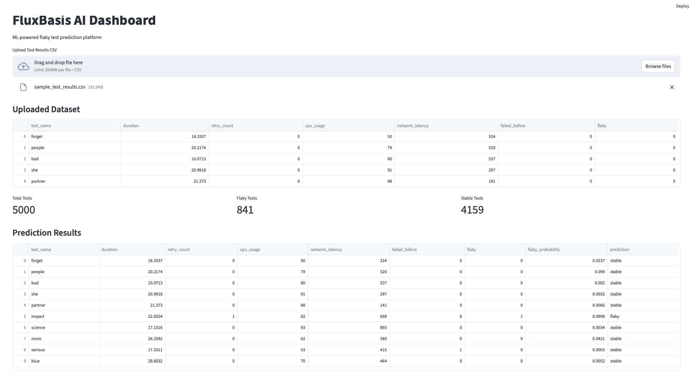
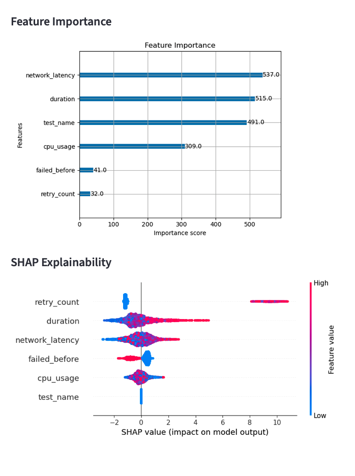
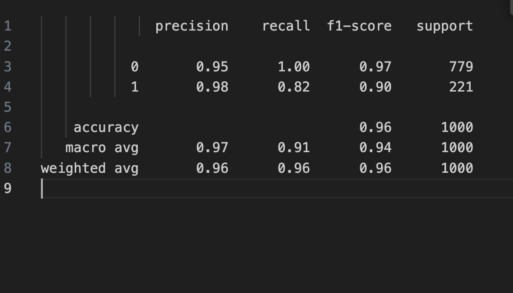
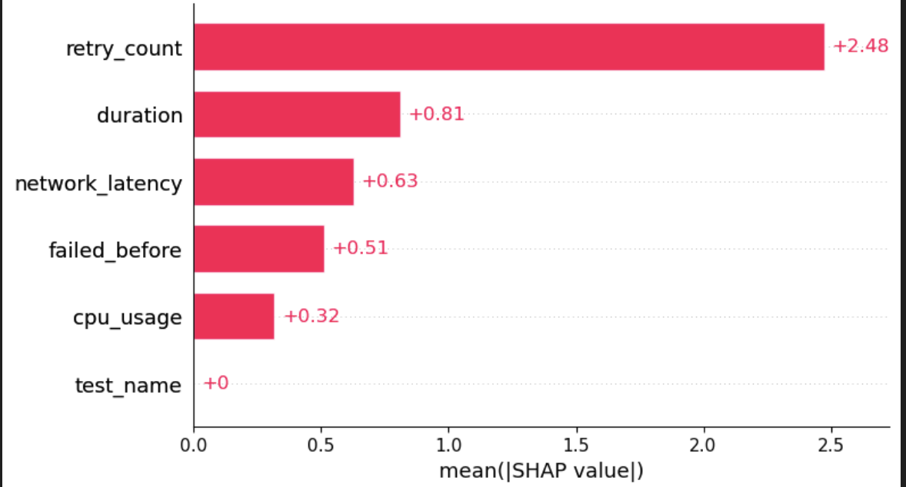
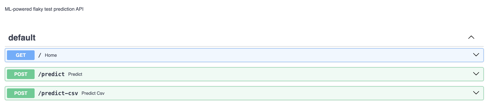

# FluxBasis AI

AI-powered flaky test prediction framework for CI/CD pipelines.

## Project Architecture
FlakeGuard AI is built on a modular architecture that integrates seamlessly with CI/CD pipelines. It consists of:
- **Data Collector**: Gathers test execution data.
- **Preprocessor**: Cleans and formats data for analysis.
- **ML Engine**: Predicts flaky tests using machine learning models.
- **Reporter**: Generates actionable insights and reports.

## Machine Learning Workflow
1. **Data Collection**: Collect historical test execution logs.
2. **Feature Engineering**: Extract features like test duration, failure patterns, etc.
3. **Model Training**: Train models on labeled data to classify flaky tests.
4. **Prediction**: Use trained models to predict flaky tests in real-time.
5. **Feedback Loop**: Continuously improve predictions with new data.

## Setup Instructions
1. Clone the repository:
    ```bash
        git clone https://github.com/your-repo/flakeguard-ai.git
        cd flakeguard-ai
    ```
    git clone https://github.com/your-repo/flakeguard-ai.git
    cd flakeguard-ai
    ```
2. Install dependencies:
    ```bash
    pip install -r requirements.txt
    ```
3. Configure your CI/CD pipeline to integrate FlakeGuard AI.
4. Run the framework:
    ```bash
    python main.py
    ```

## Screenshots


## Example Predictions
| Test Name       | Prediction | Confidence |
|------------------|------------|------------|
| test_login      | Flaky      | 92%        |
| test_checkout   | Stable     | 87%        |

## Supported Frameworks
- **Selenium**: Automates browser testing.
- **Playwright**: End-to-end testing for modern web apps.
- **Pytest**: Python testing framework.
- **TestNG**: Java testing framework.

## Future Roadmap
- Add support for additional testing frameworks.
- Improve model accuracy with advanced algorithms.
- Provide detailed root cause analysis for flaky tests.
- Develop a web-based dashboard for real-time monitoring.

## CI/CD Integration
Integrate FlakeGuard AI into your CI/CD pipeline by adding it as a pre-build step. Use the generated reports to decide whether to proceed with the deployment or investigate flaky tests.


## Upcoming Features

- Multi-framework test report ingestion
  - Playwright
  - Selenium
  - Cypress
  - JUnit XML

- Canonical CI telemetry normalization layer

- dbt-powered feature engineering pipelines

- Airflow orchestration for scheduled ingestion and retraining

- Intelligent test selection using ML

- NLP-powered failure categorization and clustering

- AI-assisted root cause analysis for failed tests

- Retry recommendation engine

- CI reliability scoring and trend analytics

- Real-time observability dashboard

- Visual regression intelligence using screenshots

- Drift detection and automated model retraining

- Docker and Kubernetes deployment support

# Dashboard Preview





# Classification Report



# SHAP



# swaggerApi



For more details, refer to the [documentation](path/to/documentation).


